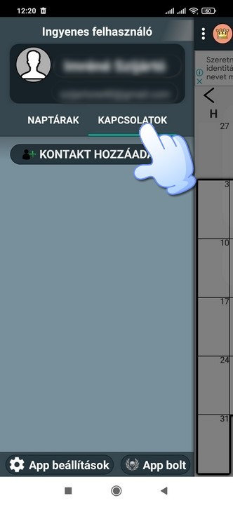
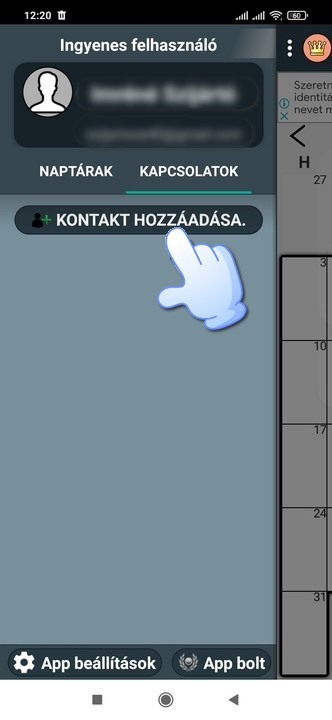
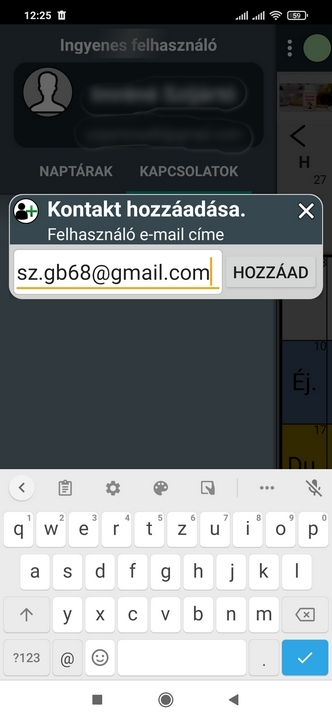
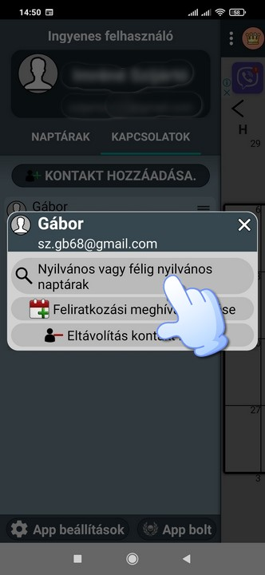
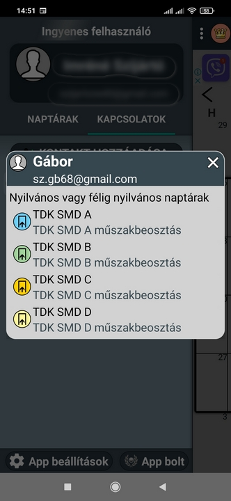
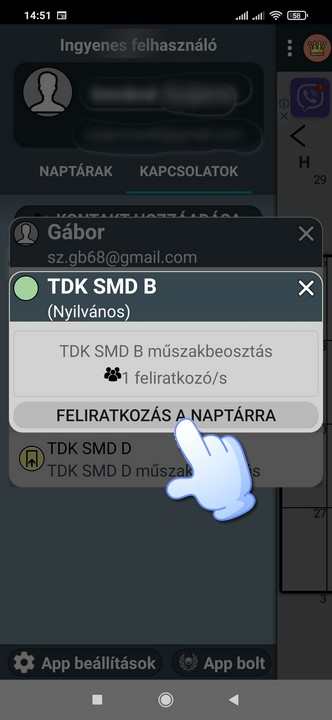
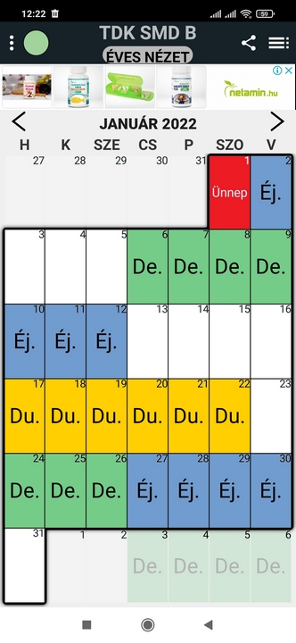

# Naptár felíratkozás

Klikk a Kapcsolatokra.

Klikk a Kontakt hozzáadására.

Írd be az sz.gb68@gmail.com email címet majd nyomd meg a Hozzáad gombot.

Klikk a Nyilvános vagy félig nyilvános naptárakra.

Válaszd ki annak a műszaknak a naptárát amelyikre szükséged van (Az app  ingyenes verziójába maximum 2 naptárt használhatsz).

Majd klikk a Feliratkozás a naptárra.

És kiválasztva a naptárt már használható is.

