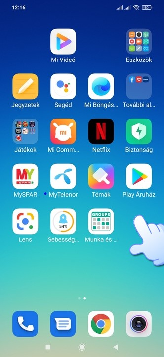
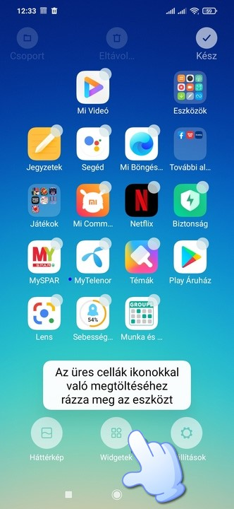
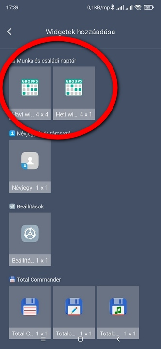
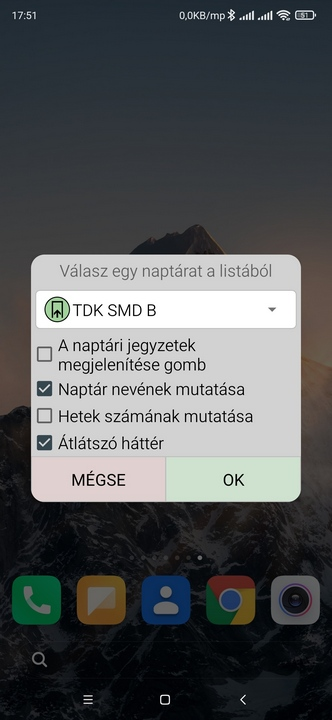
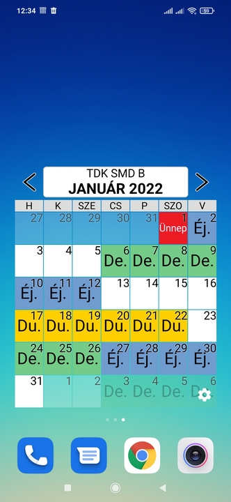

# Widget (minialkalmazás)

A képernyőn érints meg hosszan egy üres helyet.

Koppints a Widgetek elemre.

Keresd meg a munka és családi naptárt és válasz a havi vagy heti nézet közül.

Válaszd ki a megjelenítendő naptárat, állítsd be a neked tetsző beállításokat és nyomd  meg az OK gombot.

A havi nézet nézete:

